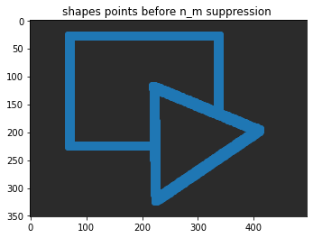
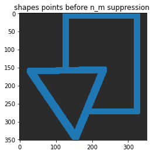
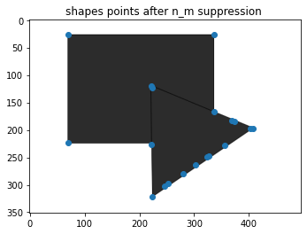
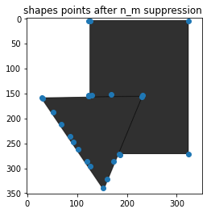

# Harris-corner-detector-implementation
 Corner Harris implementation
## Work Description

In this work we Implement the famous Harris corner detector, where we calculate the Response on every pixel and then applying local non-maximum suppression to keep only the big Responses in each region

#### Code Review
* Function `harris_response`
* Function `non_max_suppresion`

### Results
* **Harris Response**
|Regular shape | Rotated shape|
|--|--|
|||

* **Harris Response after non max suppression**
|Regular shape | Rotated shape|
|--|--|
|||
